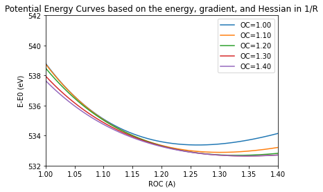
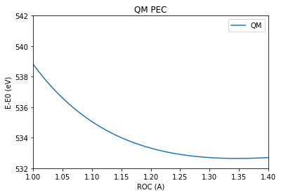
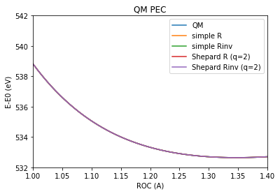

# Potential energy surfaces by interpolation

## Core-excited state PES by interpolation


```python
import MolecGeom
import impes
import MatPltHelp as my_plot
import numpy as np
import py3Dmol as p3d

np.set_printoptions(precision=7, suppress=True)
```


```python
gs_acetic_acid = MolecGeom.Geometry()
gs_acetic_acid.new_read_xyz("mp2_opt_def2.xyz")
```

### Transform the gradient and Hessian to internal coordinates

#### 1. Define a set of internal coordinates via  a Z-matrix


```python
zmat = [[0,7], [0,3], [7,0,3], [3,1], [0,3,1], [7,0,3,1], [2,3], 
        [2,3,0], [2,3,0,7], [4,2], [4,2,3], [4,2,3,1], [5,2], [5,2,3],
        [5,2,3,1], [6,2], [6,2,3], [6,2,3,1] ]
```

#### 2 Read the gradient and Hessian in Cartesian coordinates and tranform to internal coordinates

The steps for transforming Cartesian $x$ to internal $q$ coordinates are:
1. Determine the Willson  $\mathbf{B}$ matrix:
   \begin{equation}
   B_{ij} = \frac{\partial q_i}{\partial x_j}
   \end{equation}

2. Construct the  $\mathbf{G}$ martix:
   \begin{equation}
   \mathbf{G} = \mathbf{B}\mathbf{B}^\mathrm{T}
   \end{equation}

3. Set up and solve the eigenvalue equation for $\mathbf{G}$, to separate out redundancies:
   \begin{equation}
       \mathbf{G}\begin{pmatrix}\mathbf{U} & \mathbf{R}\end{pmatrix} =\begin{pmatrix}\mathbf{U} & \mathbf{R}\end{pmatrix}    \begin{bmatrix}
    \boldsymbol{\Lambda} & 0 \\
    0 & 0
    \end{bmatrix}
   \end{equation}

4. Select the non-zero eigenvalues $\boldsymbol{\Lambda}$ and corresponding eigenvectors and construct the generalized inverse matrix $\mathbf{G}^{-}$: 

 \begin{equation}
       \mathbf{G}^{-} = \begin{pmatrix}\mathbf{U} & \mathbf{R}\end{pmatrix} \begin{bmatrix} \boldsymbol{\Lambda}^{-1} & 0 \\0 & 0\end{bmatrix}\begin{pmatrix}\mathbf{U}^\mathrm{T}\\ \mathbf{R}^\mathrm{T}\end{pmatrix}
   \end{equation}

5. The gradient can be transformed using:
   \begin{equation}
   \mathbf{g}_q = \mathbf{G}^{-}\mathbf{B}\mathbf{g}_x
   \end{equation}
   
6. For the Hessian, the second order derivatives of internal coordinates with respect to Cartesian coordinates are required:
   \begin{equation}
    B^{(2)}_{ijk} = \frac{\partial^2 q_i}{\partial x_j\partial x_k}
   \end{equation}
   
7. Then, the Hessian is transformed by:
   \begin{equation}
    \mathbf{H}_q = \mathbf{G}^{-} \mathbf{B} \left[ \mathbf{H}_x - \mathbf{g}_q \mathbf{B}^{(2)}\right]\mathbf{B}^\mathrm{T} \mathbf{G}^{-\mathrm{T}}
   \end{equation}

8. The transformation to use $u=1/R$ instead of $R$ is a simple change of variables:

   \begin{equation}
    g(u) = \frac{\mathrm{d} E}{\mathrm{d}u}=\frac{\mathrm{d} E}{\mathrm{d}R}\frac{\mathrm{d} R}{\mathrm{d}u} = \frac{\mathrm{d} E}{\mathrm{d}R}\frac{\mathrm{d} u^{-1}}{\mathrm{d}u} =  -u^{-2}\,g(R) =  -R^{2} \,g(R)
   \end{equation}


```python
# Some pre-requisites
fileName = "mp2_opt_def2.xyz"
co_index = 3 # index in the Z-matrix of the coord. of interest (C=O bond here)
AtoBohr = 1.8897161646320724 # conversion factor from Ångstrom to Bohr
HtoeV = 27.211385 # conversion factor from Hartree to eV
gs_mp2 = -228.28777810 # GS energy at equilibrium geometry

# Names of the files containing the gradient and Hessian in Cartesian coordinates:
names = ["mp2_opt_def2",
         "forpes_corr_1.00_1.50",
         "forpes_corr_1.05_1.50",
         "forpes_corr_1.10_1.50",
         "forpes_corr_1.15_1.50",
         "forpes_corr_1.20_1.50",
         "forpes_corr_1.25_1.50",
         "forpes_corr_1.30_1.50",
         "forpes_corr_1.35_1.50",
         "forpes_corr_1.40_1.50",
        ]

# using R
Rs = [] #list with values of the O=C bond length
Es = [] #list of energies
gs = [] #list of the gradients transformed to internal coordinates
Hs = [] #list of Hessians transformed to internal coordinates

# using 1/R
gs_rinv = [] # the gradient using 1/R
Hs_rinv = [] # the Hessians using 1/R

for name in names:
    molecule = MolecGeom.Geometry()
    molecule.new_read_xyz(fileName)
    
    # Read the Cartesian coordinates, energy, gradient and Hessian
    molecule.read_cart(name+"_new_cvs-adc2x_def2-SVP.cart")
    #print("Energy: %15.5f H." % molecule.energy)

    # Transform Cartesian coordinates to internal coordinates using
    # derivatives of q wrt. x from geomeTRIC
    molecule.transform_to_internals_geomeTRIC(zmat)
    molecule.transform_Hessian_to_internal()

    molecule.symmetrize_internal_Hessian()

    R = molecule.internals[co_index] * AtoBohr #! Must be in Bohr!
    E = (molecule.energy - gs_mp2) * HtoeV
    G = molecule.internal_gradient[co_index]
    H = molecule.internal_hessian[co_index, co_index]

    # Append data for interpolation
    Rs.append(R)
    gs.append(G)
    Hs.append(H)
    Es.append(E)
    
    # Transform to 1/R:
    # Uncomment if you want to use 1/R (Rinv)
    molecule.transform_to_Rinv()
    Ginv = molecule.internal_gradient[co_index]
    Hinv = molecule.internal_hessian[co_index, co_index]
    gs_rinv.append(Ginv)
    Hs_rinv.append(Hinv) 
    molecule.remove_all()
```

### Use the energy, gradient, and Hessian to represent the core-excited state PES analytically
\begin{equation}
V_i(\mathbf{q}) = E_i + (\mathbf{q}-\mathbf{q}_i)\,\mathbf{g}_i + \frac12 (\mathbf{q}-\mathbf{q}_i)\, \mathbf{H}_i \, (\mathbf{q}-\mathbf{q}_i)^\mathrm{T}
\end{equation}


```python
n = len(Rs)
Vs = [] #list of potentials for interpolation
Vs_rinv = [] #list of potentials for interpolation, 1/R
oc = np.arange(1.0, 1.41, 0.002) # grid to represent the potential on
ref = [] # required for the plot routine 
xs = [] # required for the plot routine
labels = []
for i in range(n):
    vi = impes.calculate_pes(Rs[i], Es[i], gs[i], Hs[i], oc, inverse=False) # inverse=False -> use R; inverse=True -> use 1/R
    Vs.append(vi)
    vinv = impes.calculate_pes(Rs[i], Es[i], gs_rinv[i], Hs_rinv[i], oc, inverse=True)
    Vs_rinv.append(vinv)
    ref.append(0)
    xs.append(oc)
    if "mp2" in names[i]:
        labels.append("OC=1.21")
    else:
        labels.append("OC="+names[i][-9:-5])
```


```python
# Plot
min_qm = 532
max_qm = 542

my_plot.plot_1d(xs[1::2], Vs[1::2], labels=labels[1::2],
               gs=ref[1::2],
               title="Potential Energy Curves based on the energy, gradient, and Hessian in R",
               name = "qm_vs_my_impes_R.eps", xlabel="ROC (A)",
               ylabel="E-E0 (eV)", au=True, xax=[1.0,1.4], save='no',
               yax=[min_qm,max_qm],
               )
```


```python
my_plot.plot_1d(xs[1::2], Vs_rinv[1::2], labels=labels[1::2],
               gs=ref[1::2],
               title="Potential Energy Curves based on the energy, gradient, and Hessian in 1/R",
               name = "qm_vs_my_impes_R.eps", xlabel="ROC (A)",
               ylabel="E-E0 (eV)", au=True, xax=[1.0,1.4], save='no',
               yax=[min_qm,max_qm],
               )
```





### Construct the interpolated core-excited state PES
\begin{equation}
V(\mathbf{q}) = \sum_i w_i(\mathbf{q}) V_i(\mathbf{q}),
\end{equation}
where $w_i(\mathbf{q})$ are the normalized weights:
\begin{equation}
w_i(\mathbf{q}) = \frac{v_i(\mathbf{q})}{\sum_j v_j(\mathbf{q})}
\end{equation}

There are different ways to determine the unnormalized weights:
1. Simple interpolation:
\begin{equation}
v_i(\mathbf{q}) = \frac{1}{(\mathbf{q}-\mathbf{q}_i)^{2p}}
\end{equation}

2. Shepard interpolation:
\begin{equation}
v_i(\mathbf{q}) = \frac{1}{\left[\frac{\mathbf{q}-\mathbf{q}_i}{\mathrm{rad}}\right]^{2p}+\left[\frac{\mathbf{q}-\mathbf{q}_i}{\mathrm{rad}}\right]^{2q}}
\end{equation}


```python
simple_r = impes.simple_interpolate(Rs, Vs, oc, exponent=12)
shepard_r = impes.interpolate(Rs, Vs, oc, exp1=24, exp2=4, crad=0.5)
simple_rinv = impes.simple_interpolate(Rs, Vs_rinv, oc, exponent=12)
shepard_rinv = impes.interpolate(Rs, Vs_rinv, oc, exp1=24, exp2=4, crad=0.5)
```


```python
# Import QM PES
folder = '/home/emi/Documents/CALCULATIONS/adc_grad/XES_AA/'
folder += 'single_molecule/correct_O1s/QMPES/'
qm_data = np.loadtxt(folder+'partial_energy_data.dat')

qoc = np.arange(1.0, 1.41, 0.01)
cch3 = np.arange(1.2,1.71, 0.01)
noc = len(qoc)
ncch3 = len(cch3)

qm_energy = np.zeros((noc,ncch3))

k = 0
l = 0
qm_1d_cut = np.zeros_like(qoc)
for i in range(len(qoc)): #rOC in oc:
    for j in range(ncch3): #rCCH3 in cch3
        if abs(cch3[j]-1.5) < 1e-7:
            qm_1d_cut[i] = qm_data[k, 2]
        k += 1

qm_1d_cut = (qm_1d_cut - gs_mp2) * HtoeV
```


```python
# Plot interpolated PES vs. QM PES
xs = [qoc, oc, oc, oc, oc]
to_plot = [qm_1d_cut, simple_r, simple_rinv, shepard_r, shepard_rinv]
ref = [0,0,0,0,0]
labels = ['QM', 'simple R', 'simple Rinv', 'Shepard R (q=2)', 'Shepard Rinv (q=2)']

my_plot.plot_1d(xs[:1], to_plot, labels=labels,
               gs=ref,
               title="QM PEC",
               name = "qm_vs_my_impes_q2.eps", xlabel="ROC (A)",
               ylabel="E-E0 (eV)", au=True, xax=[1.0,1.4], save='no',
               yax=[min_qm,max_qm],
               )
```





```python
my_plot.plot_1d(xs, to_plot, labels=labels,
               gs=ref,
               title="QM PEC",
               name = "qm_vs_my_impes_q2.eps", xlabel="ROC (A)",
               ylabel="E-E0 (eV)", au=True, xax=[1.0,1.4], save='no',
               yax=[min_qm,max_qm],
               )
```




